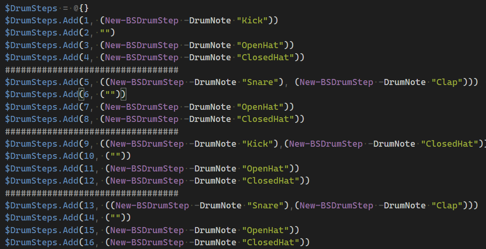

# 💙🥁🎹🎶 BlueStepper 🎶🎹🥁💙
PowerShell BPM Based MIDI Step Sequencer for Windows 10

# What is this thing

BlueStepper is a very simple PowerShell based 16th note [Step Sequencer](https://en.wikipedia.org/wiki/Music_sequencer) which allows for definition of the note sequence and tempo through PowerShell.

Each "Step" is simply an element in a PowerShell [Hasthtable](https://docs.microsoft.com/en-us/dotnet/api/system.collections.hashtable?view=netframework-4.8) that is populated with strings indicating which Note should be played.

This module uses [Psychlist1972's PowerShell MIDI Module](Windows-10-PowerShell-MIDI) for all MIDI Operations which uses the [multi-client MIDI API for Windows 10](https://blogs.windows.com/windowsdeveloper/2016/09/21/midi-enhancements-in-windows-10/). Therefore BlueStepper is **only compatible with Windows 10**.

In **Play mode**, the hashtable is iterated through in time to the set [BPM](https://en.wikipedia.org/wiki/Tempo) of the sequencer played each elements defined note. The time it takes PowerShell to trigger each note during step playback is measured and subtracted from the total step time to attempt to keep timing.

Typically it takes less than 1ms to perform note operations, this leaves over 100ms in a 120BPM 16th step. Complex Steps may take up to 10ms - certainly not professional grade but to the novice ear it's imperceptible!

The best use case it combining BlueStepper with a USB Midi Interface to send notes to Drum Machines, Synthesizers, or any other device with a MIDI input.

used to interact with Midi Interfaces to send midi notes to external interfaces.
in a very simple and "PowerShell'ey" way that is very noobie friendly. This was never meant to be the "BE ALL END ALL" step sequencer, but it can do some pretty cool things and sounds pretty good! 

# Features
* Simple and very PowerShell friendly - make some cool beats and learn PowerShell at the same time!
* Program 4 different instruments patterns with "infinite" number of steps in a pattern
* Helper Functions to make writing music sequences easy:
    * Translation of Note to MIDI note number
    * Easy setup / and helpers for Synthesizers, Drum Machines
* Adjustable BPM
* Arpeggiator
* "Pretty Good" time keeping... for PowerShell anyways 😊
* Debug Output! 

# Demos
Here are some classics with have parts sequenced from scratch using BlueStepper and played on real synthesizers

* [New Order - Blue Monday](https://twitter.com/LeeAlanBerg/status/1226074288538685440)
* [Kraftwerk - We are the Robots](https://twitter.com/LeeAlanBerg/status/1226281609156059137)
* [The Human League - Don't You Want Me](https://twitter.com/LeeAlanBerg/status/1226318499867480064)
* Cyndi Lauper - She Bop
* Dead or Alive - You Spin me right Round
* Rick Astley - Never Gonna Give You Up
* Tears For Fears - Shout
* Depeche Mode - Just Can't Get Enough
* Depeche Mode - Never Let Me Down Again
* Madonna - Papa don't Preach

# Download
Source and Release "Soon"

